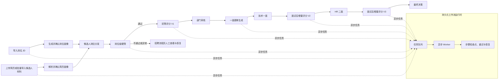
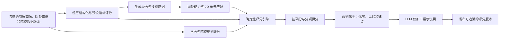
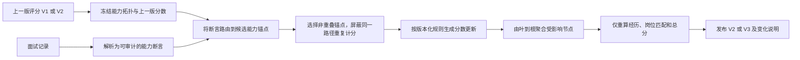

# AI 招聘评估系统

面向招聘流程的工作流驱动系统：将岗位解析、候选人简历和材料导入、硬筛、初筛、面试及最终决策组织为可追踪、可恢复的异步流程，并提供基于证据的评分与面试后增量更新能力。

## 项目亮点

### 1. 端到端招聘流程



- 业务对象与异步执行解耦：`WorkflowRun` 保存任务状态，步骤检查点保存每一步的可恢复状态，正式结果保存到领域表。
- 外部 PDF 解析、模型调用和对象存储访问都在数据库事务外执行；临时故障按步骤退避重试，永久故障提供可见的恢复操作。
- 候选人材料归属候选人，某次投递（Application）只关联本次申请特有的文件，避免多岗位投递时材料被重复或误删。

### 2. 可解释初筛打分



- 简历经历、岗位匹配和学历背景分别计算，再由确定性评分引擎汇总；模型负责结构化和解释，不直接自由决定最终分数。
- 每次评分固定输入版本和证据索引，可定位“某一项分数为何变化”，并避免后续资料更新覆写历史结论。
- 硬筛规则独立于综合评分，在进入初筛前按岗位配置判断，支持直接通过、拦截和人工复核。

### 3. 面试后的增量更新



- 面试结论只更新与证据相关的能力锚点，未受影响的节点保留上一版本数值，不重新执行完整初筛。
- 同一面试断言在同一能力路径只选择一个锚点，防止父子节点重复计分；负向更新还受单轮最大降幅保护。
- 输出分数变化、受影响能力、证据引用和版本号，供 HR 在招聘流程中复核。

## 使用说明

### 1. 环境与配置

需要 Docker Desktop（Linux Engine）或兼容 Docker Compose 的 Linux 环境，并预留 `5173`、`8000`、`8010`、`5432`、`19000`、`19001` 端口。

在项目根目录复制配置模板：

```powershell
Copy-Item .env.example .env
```

至少在 `.env` 中配置数据库、MinIO、登录密钥、预置账号，以及 Importer 的工作目录和 API Key；模型配置填写在 `config/llm.local.json`。真实密钥只保存在本地配置中，不应提交到 Git。

### 2. 启动与访问

在项目根目录执行：

```powershell
.\scripts\ops\preflight.ps1 -RequireDocker
.\scripts\ops\compose.ps1 up -d --build
.\scripts\ops\compose.ps1 ps
```

| 服务 | 地址 | 用途 |
| --- | --- | --- |
| 前端 | http://127.0.0.1:5173 | 招聘业务操作界面 |
| Backend | http://127.0.0.1:8000/api/v1 | 核心业务 API |
| Backend 健康检查 | http://127.0.0.1:8000/ready | 服务就绪状态 |
| Importer | http://127.0.0.1:8010 | 候选人文件夹导入 API |
| MinIO 控制台 | http://127.0.0.1:19001 | 对象存储管理 |

停止服务：

```powershell
.\scripts\ops\compose.ps1 stop
```

不要使用 `docker compose down -v`，该命令会删除 PostgreSQL 与 MinIO 的数据卷。

### 3. 日常操作

1. 使用 HR 账号登录，在系统管理中维护部门、角色、数据范围与职责包。
2. 在岗位管理中导入并确认 JD，配置岗位信息和硬筛规则。
3. 在简历处理页上传文件、批量拖入文件或文件夹，或通过 Importer 接收上游候选人文件夹。
4. 在招聘流程页查看候选人的申请状态；正常流程的推进在任务中心工作台完成，异常状态在当前页面查看、确认或恢复。
5. 依次处理部门审核、一面、二面与最终决策，并在评分版本中查看证据和变化。

常用排查命令：

```powershell
.\scripts\ops\compose.ps1 logs --tail 200 backend
.\scripts\ops\compose.ps1 logs --tail 200 worker
.\scripts\ops\compose.ps1 logs --tail 200 importer
Invoke-WebRequest http://127.0.0.1:8000/ready
Invoke-WebRequest http://127.0.0.1:8010/health
```

部署、导入器和权限约定的详细说明见 [openEuler 部署文档](docs/openEuler部署文档.md)、[Importer 说明](importer/README.md) 与 [权限执行约定](docs/authorization_execution_contract.md)。
